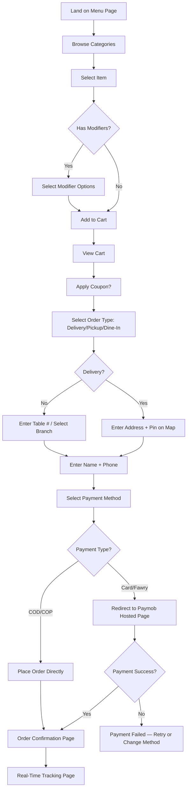
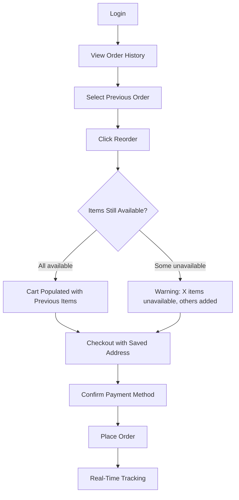
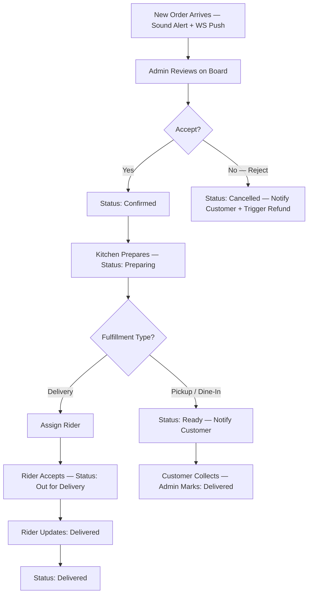
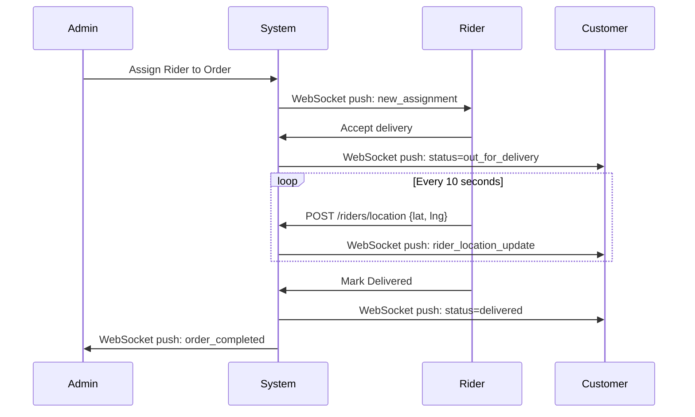

# PRD: Online Food Ordering Platform — Alexandria, Egypt
## Version 1.0.0 | Classification: Internal Engineering | Date: 2025

---

# TABLE OF CONTENTS

1. [Executive Summary](#1-executive-summary)
2. [Product Vision](#2-product-vision)
3. [Business Goals](#3-business-goals)
4. [User Personas](#4-user-personas)
5. [User Stories](#5-user-stories)
6. [Functional Requirements](#6-functional-requirements)
7. [Non-Functional Requirements](#7-non-functional-requirements)
8. [Full Feature Breakdown](#8-full-feature-breakdown)
9. [User Flows](#9-user-flows)
10. [Information Architecture](#10-information-architecture)
11. [System Architecture](#11-system-architecture)
12. [Frontend Architecture](#12-frontend-architecture)
13. [Backend Architecture](#13-backend-architecture)
14. [Database Design](#14-database-design)
15. [ERD Description](#15-erd-description)
16. [API Design](#16-api-design)
17. [Authentication Flows](#17-authentication-flows)
18. [Payment Flows](#18-payment-flows)
19. [Real-Time Tracking Architecture](#19-real-time-tracking-architecture)
20. [Admin Dashboard Architecture](#20-admin-dashboard-architecture)
21. [Localization / i18n Architecture](#21-localization--i18n-architecture)
22. [PWA Architecture](#22-pwa-architecture)
23. [Security Architecture](#23-security-architecture)
24. [Performance Optimization Strategy](#24-performance-optimization-strategy)
25. [Scalability Strategy](#25-scalability-strategy)
26. [CI/CD Strategy](#26-cicd-strategy)
27. [Infrastructure & Deployment](#27-infrastructure--deployment)
28. [Monitoring & Logging](#28-monitoring--logging)
29. [Analytics Strategy](#29-analytics-strategy)
30. [Testing Strategy](#30-testing-strategy)
31. [Acceptance Criteria](#31-acceptance-criteria)
32. [MVP Scope](#32-mvp-scope)
33. [Post-MVP Scope](#33-post-mvp-scope)
34. [Risk Analysis](#34-risk-analysis)
35. [Technical Tradeoffs](#35-technical-tradeoffs)
36. [Third-Party Services](#36-third-party-services)
37. [Environment Variables Structure](#37-environment-variables-structure)
38. [Folder Structure Recommendations](#38-folder-structure-recommendations)
39. [Recommended Database Schema](#39-recommended-database-schema)
40. [Recommended API Endpoints](#40-recommended-api-endpoints)
41. [Recommended WebSocket Events](#41-recommended-websocket-events)
42. [State Management Strategy](#42-state-management-strategy)
43. [Error Handling Standards](#43-error-handling-standards)
44. [Accessibility Considerations](#44-accessibility-considerations)
45. [SEO Strategy](#45-seo-strategy)
46. [Mobile Responsiveness Strategy](#46-mobile-responsiveness-strategy)
47. [Delivery Roadmap — 12 Weeks](#47-delivery-roadmap--12-weeks)
48. [Sprint Planning Recommendation](#48-sprint-planning-recommendation)
49. [Team Composition Recommendation](#49-team-composition-recommendation)
50. [Cost Estimation Guidance](#50-cost-estimation-guidance)
51. [Definition of Done](#51-definition-of-done)
52. [Open Questions & Assumptions](#52-open-questions--assumptions)

---

# 1. Executive Summary

This document defines the complete Product Requirements for an MVP Online Food Ordering Platform targeting a single restaurant brand in **Alexandria, Egypt**. The application supports three fulfillment modes — **dine-in**, **delivery**, and **pickup** — and must reach production launch within a **12-week development sprint**.

The platform serves four distinct actor classes: customers (web/PWA), restaurant administrators (dashboard), delivery riders (mobile-optimized web), and the system itself (automated workflows). It integrates real-time order tracking, multi-language support (English/Arabic with full RTL), Egypt-specific payment methods (Fawry, card, wallet, COD), and a complete operational backend.

**Engineering mandate:** Deliver a production-grade system with strong architectural foundations — not a prototype. Every decision in this document is optimized for the triad of **fast MVP delivery**, **long-term scalability**, and **operational security**.

---

# 2. Product Vision

> Deliver the fastest, most reliable digital ordering experience in Alexandria — enabling customers to order seamlessly in Arabic or English across delivery, pickup, and dine-in, while giving operations full real-time control.

**Core Differentiators:**
- Native Arabic/RTL UX with no translation afterthoughts
- Real-time order status with live rider GPS tracking
- Egypt-local payment methods (Fawry) alongside international cards
- PWA enabling home-screen install without App Store friction
- Sub-2-second page loads on Egyptian mobile networks (3G/4G)

---

# 3. Business Goals

| # | Goal | Metric | Target (3 months post-launch) |
|---|------|--------|-------------------------------|
| BG-01 | Increase order volume vs phone/walk-in | Orders/day via digital | 60% of total orders |
| BG-02 | Reduce order errors | Incorrect order rate | < 1% |
| BG-03 | Reduce operational overhead | Avg time per order (staff) | -40% vs manual |
| BG-04 | Customer retention | Repeat order rate (30-day) | ≥ 35% |
| BG-05 | Payment modernization | % cashless payments | ≥ 40% |
| BG-06 | Delivery efficiency | Avg delivery time | < 45 min |
| BG-07 | Digital presence | Organic search traffic | 500+ monthly visitors |

---

# 4. User Personas

### Persona 1 — Amira (Primary Customer)
- **Age:** 26 | **Role:** University student
- **Device:** Samsung Galaxy A series, 4G network
- **Language:** Arabic preferred, English capable
- **Behavior:** Orders 3-4x/week, price-sensitive, uses coupons, shares orders via WhatsApp
- **Pain Points:** Slow websites on mobile, confusing checkout, no Arabic UI
- **Goals:** Fast reorder, coupon visibility, ETA transparency

### Persona 2 — Khaled (Family Customer)
- **Age:** 42 | **Role:** Engineer, family man
- **Device:** iPhone, home WiFi
- **Language:** English
- **Behavior:** Weekly family orders, larger basket size, prefers delivery scheduling
- **Pain Points:** Can't customize orders easily, no saved addresses
- **Goals:** Customization, scheduled delivery, invoice for business expense

### Persona 3 — Omar (Restaurant Admin)
- **Age:** 35 | **Role:** Restaurant Operations Manager
- **Device:** Desktop Chrome + iPad
- **Language:** Arabic
- **Behavior:** Monitors orders in real-time, manages menu daily, handles refunds
- **Pain Points:** No live order visibility, manual Excel reporting
- **Goals:** Real-time order queue, quick item enable/disable, daily revenue snapshot

### Persona 4 — Ahmed (Delivery Rider)
- **Age:** 23 | **Role:** Delivery Driver
- **Device:** Android budget phone, 3G/4G
- **Language:** Arabic
- **Behavior:** Receives delivery assignments, navigates to customer, updates status
- **Pain Points:** No clear address mapping, delayed assignment notifications
- **Goals:** Simple UI, fast status updates, clear navigation link

---

# 5. User Stories

### Customer Stories

| ID | As a... | I want to... | So that... | Priority |
|----|---------|-------------|-----------|----------|
| US-C01 | Guest user | Browse the menu without registering | I can decide what to order quickly | P0 |
| US-C02 | Customer | Filter menu by category/subcategory | I find items faster | P0 |
| US-C03 | Customer | Add items with modifiers to cart | I get exactly what I want | P0 |
| US-C04 | Customer | Checkout as guest with phone+name | I don't have to register | P0 |
| US-C05 | Customer | Register with email/password | I can track orders and reorder | P0 |
| US-C06 | Customer | Login with Google OAuth | I authenticate without a new password | P0 |
| US-C07 | Customer | Login with phone OTP | I use my Egyptian phone number | P0 |
| US-C08 | Customer | Apply a coupon code | I get a discount | P0 |
| US-C09 | Customer | Track my order in real-time | I know when to expect it | P0 |
| US-C10 | Customer | See the rider's live location on a map | I can plan accordingly | P1 |
| US-C11 | Customer | Pay with Fawry | I use Egypt's popular payment method | P0 |
| US-C12 | Customer | Pay by card (Visa/MasterCard) | I pay digitally | P0 |
| US-C13 | Customer | Pay cash on delivery | I'm not comfortable with online payments | P0 |
| US-C14 | Customer | Schedule a delivery | I want it at a specific time | P1 |
| US-C15 | Customer | Save multiple delivery addresses | I reorder from work/home easily | P1 |
| US-C16 | Customer | View my order history | I can reorder favorite meals | P1 |
| US-C17 | Customer | Switch to Arabic UI | I prefer my native language | P0 |
| US-C18 | Registered customer | Reset my password via email | I can recover access | P0 |
| US-C19 | Customer | Receive order status notifications | I stay updated without checking app | P1 |
| US-C20 | Customer | Cancel an order (within window) | I changed my mind | P1 |

### Admin Stories

| ID | As an... | I want to... | So that... | Priority |
|----|---------|-------------|-----------|----------|
| US-A01 | Admin | See all incoming orders in real-time | I manage the kitchen queue | P0 |
| US-A02 | Admin | Update order status | The customer stays informed | P0 |
| US-A03 | Admin | Add/edit/delete menu items | I keep the menu current | P0 |
| US-A04 | Admin | Enable/disable items instantly | I 86 items that run out | P0 |
| US-A05 | Admin | Create and manage coupons | I run promotions | P0 |
| US-A06 | Admin | View daily revenue and reports | I track business performance | P1 |
| US-A07 | Admin | Manage users (view, block) | I handle abuse cases | P1 |
| US-A08 | Admin | Create orders manually | I take phone orders digitally | P1 |
| US-A09 | Admin | Upload/manage banners | I promote specials | P1 |
| US-A10 | Admin | Assign riders to orders | I dispatch deliveries | P0 |

### Rider Stories

| ID | As a... | I want to... | So that... | Priority |
|----|---------|-------------|-----------|----------|
| US-R01 | Rider | See assigned deliveries | I know my tasks | P0 |
| US-R02 | Rider | Update delivery status | The customer and admin know | P0 |
| US-R03 | Rider | Share my live GPS location | The customer can track me | P0 |
| US-R04 | Rider | View customer address and map link | I navigate correctly | P0 |

---

# 6. Functional Requirements

> Written in EARS (Easy Approach to Requirements Syntax) format.

### Authentication & Identity

| ID | Requirement |
|----|-------------|
| FR-AUTH-01 | When a user submits email and password, the system shall authenticate the user and return a JWT access token (15-min TTL) and refresh token (7-day TTL). |
| FR-AUTH-02 | When a user initiates Google OAuth, the system shall redirect to Google consent screen and create/update a user record upon callback. |
| FR-AUTH-03 | When a user requests phone OTP, the system shall send a 6-digit OTP via SMS to the provided Egyptian phone number and verify it within 5 minutes. |
| FR-AUTH-04 | When an access token expires, the system shall silently re-issue it using the refresh token without requiring re-login. |
| FR-AUTH-05 | When a user submits a password reset request, the system shall send a time-limited reset link (1-hour TTL) to the registered email. |
| FR-AUTH-06 | The system shall enforce password policy: minimum 8 characters, at least 1 uppercase, 1 digit, 1 special character. |
| FR-AUTH-07 | When a user account is created, the system shall send an email verification link. Unverified accounts may browse but cannot place orders. |

### Menu & Catalog

| ID | Requirement |
|----|-------------|
| FR-MENU-01 | The system shall display menu items organized by categories and subcategories, sorted by display order. |
| FR-MENU-02 | When a menu item has add-ons/modifiers, the system shall present selection groups with min/max selection constraints. |
| FR-MENU-03 | The system shall display item images, descriptions, prices, and availability status. |
| FR-MENU-04 | Where an item is marked unavailable, the system shall display it greyed-out and prevent it from being added to cart. |
| FR-MENU-05 | The system shall support bilingual item names and descriptions (EN/AR). |
| FR-MENU-06 | The system shall cache the menu response for 5 minutes, invalidated on admin menu updates. |

### Cart & Checkout

| ID | Requirement |
|----|-------------|
| FR-CART-01 | The system shall maintain a persistent cart in localStorage for guests and in the database for authenticated users. |
| FR-CART-02 | When an item's availability changes after cart addition, the system shall notify the user at checkout and prevent order placement. |
| FR-CART-03 | The system shall calculate order totals: item subtotal + add-on costs + delivery fee + tax (14% VAT Egypt) + service fee, displaying each line. |
| FR-CART-04 | When a coupon code is applied, the system shall validate it and display the discounted total before order submission. |
| FR-CART-05 | The system shall enforce minimum order amount before allowing checkout to proceed. |
| FR-CART-06 | When fulfillment type is delivery, the system shall require a delivery address with geolocation pin. |
| FR-CART-07 | The system shall allow scheduling delivery/pickup for a future time slot within the restaurant's operating hours. |

### Orders

| ID | Requirement |
|----|-------------|
| FR-ORD-01 | When an order is placed, the system shall assign it a unique order number and set status to "Placed". |
| FR-ORD-02 | The system shall transition orders through statuses: Placed → Confirmed → Preparing → Ready → Out for Delivery → Delivered / Cancelled. |
| FR-ORD-03 | When order status changes, the system shall emit a WebSocket event to the customer and admin in real-time. |
| FR-ORD-04 | When order status changes, the system shall send an SMS/push notification to the customer. |
| FR-ORD-05 | When a customer cancels within the cancellation window (before "Preparing"), the system shall process the cancellation and trigger refund if applicable. |
| FR-ORD-06 | The system shall store complete order snapshot (items, prices, modifiers) at time of placement, immutable to subsequent menu changes. |

### Payments

| ID | Requirement |
|----|-------------|
| FR-PAY-01 | The system shall integrate Paymob for card payments (Visa/MasterCard) and Fawry. |
| FR-PAY-02 | When a payment fails, the system shall retain the order in "payment_pending" state and allow retry within 15 minutes. |
| FR-PAY-03 | When a paid order is cancelled, the system shall initiate a refund through the original payment channel and set order status to "Cancelled - Refund Initiated". |
| FR-PAY-04 | The system shall never store raw card data; all card processing shall occur through PCI-compliant Paymob hosted fields. |
| FR-PAY-05 | Cash on Delivery and Cash at Pickup shall require no payment processing; payment confirmation is manual. |

### Real-Time Tracking

| ID | Requirement |
|----|-------------|
| FR-RT-01 | When a rider's order status is "Out for Delivery", the rider app shall broadcast GPS coordinates every 10 seconds via WebSocket. |
| FR-RT-02 | The customer order tracking page shall display rider location on a map, updating in real-time. |
| FR-RT-03 | When order status transitions, the customer shall see the updated status without page refresh. |
| FR-RT-04 | The admin order board shall reflect all real-time status transitions across all active orders. |

---

# 7. Non-Functional Requirements

| Category | ID | Requirement | Measure |
|----------|----|-------------|---------|
| Performance | NFR-P01 | Menu page Time to Interactive (TTI) | < 2.5s on 4G (Lighthouse) |
| Performance | NFR-P02 | API response time (p95) | < 300ms under normal load |
| Performance | NFR-P03 | WebSocket event delivery latency | < 500ms end-to-end |
| Availability | NFR-A01 | Uptime SLA | 99.5% monthly |
| Availability | NFR-A02 | Planned maintenance window | Off-peak hours only (2-4 AM EET) |
| Scalability | NFR-S01 | Concurrent WebSocket connections | Support 500+ without degradation |
| Scalability | NFR-S02 | Peak order throughput | 100 orders/minute burst |
| Security | NFR-SEC01 | OWASP Top 10 | Zero critical/high vulnerabilities |
| Security | NFR-SEC02 | Authentication tokens | Signed HS256 JWT, secrets rotated quarterly |
| Security | NFR-SEC03 | Rate limiting (auth endpoints) | 5 requests/minute/IP |
| Security | NFR-SEC04 | Rate limiting (order endpoints) | 20 requests/minute/user |
| Compliance | NFR-C01 | Egyptian VAT (14%) | Correctly applied and displayed |
| Compliance | NFR-C02 | PCI DSS | Card data never touches our servers |
| Localization | NFR-L01 | RTL layout | Full RTL when Arabic is active |
| Localization | NFR-L02 | Language persistence | Survives browser close/re-open |
| Accessibility | NFR-ACC01 | WCAG 2.1 AA | All interactive elements keyboard-navigable |
| SEO | NFR-SEO01 | Core Web Vitals | All "Good" in Google Search Console |
| Mobile | NFR-M01 | PWA installability | Passes all Lighthouse PWA checks |
| Backup | NFR-B01 | Database backup | Daily automated, 7-day retention |

---

# 8. Full Feature Breakdown

## 8.1 Customer-Facing Features

### Menu System
- Hierarchical categories (e.g., "Hot Drinks > Espresso Based")
- Item cards: image, name (EN/AR), description, base price, availability badge
- Modifier groups: single-select (radio), multi-select (checkbox)
- Required vs optional modifier groups
- Item-level notes field
- Search by item name (client-side for MVP)
- "Most Popular" and "New" badges
- Allergen info (optional per item)

### Authentication System
- Email/password with bcrypt hashing (cost factor 12)
- Google OAuth 2.0 (Google Sign-In)
- Phone + OTP (6-digit, 5-min TTL) via SMS (Vonage/Twilio)
- Guest checkout (email + phone capture at checkout)
- Password reset (email link, 1-hour TTL)
- Email verification (SendGrid)
- Account merge: if guest email matches registered user, prompt login

### Cart System
- Persistent across sessions (localStorage → database on login)
- Item quantity controls
- Modifier summary per cart item
- Per-item notes
- Coupon code field
- Order type selector: Delivery / Pickup / Dine-In
- Real-time price calculation
- Minimum order warning

### Checkout Flow
- Delivery: Address autocomplete (Google Maps Places API), map pin placement, landmark/notes
- Pickup: Branch selection (single branch for MVP)
- Dine-In: Table number entry
- Scheduled time: Date/time picker within operating hours
- Payment method selection
- Order summary review
- Guest info capture (name, phone, email optional)
- Order placement confirmation

### Order Management (Customer)
- Active order tracking page with status timeline
- Live rider map (when "Out for Delivery")
- ETA display
- Cancellation button (pre-Preparing status only)
- Order history list
- Reorder button (adds previous items to cart)

### Profile Management
- Name, email, phone (editable)
- Saved addresses (CRUD, set default)
- Password change
- Notification preferences
- Language preference

### PWA Features
- Add to Home Screen prompt
- Offline menu browsing (cached via Service Worker)
- Background push notifications (order status updates)

## 8.2 Admin Features

### Order Management Dashboard
- Real-time order board (Kanban-style columns by status)
- Order detail modal: items, customer info, address, payment
- Status update buttons per order
- Rider assignment dropdown
- Print receipt
- Manual order creation form
- Search/filter by: status, date range, order #, customer phone
- Sound alert on new order

### Menu Management
- Category CRUD with drag-and-drop ordering
- Subcategory CRUD
- Item CRUD: name EN/AR, description EN/AR, price, images, category, availability toggle
- Modifier group CRUD: name EN/AR, type (single/multi), min/max, items with prices
- Bulk availability toggle
- Image upload to cloud storage (Cloudinary)

### User Management
- Customer list with search/filter
- View customer order history
- Block/unblock account
- Guest order history lookup by phone

### Coupon Management
- Create coupons: code, type (% / fixed / free delivery), value, min order, usage limit, per-user limit, expiry date
- Enable/disable coupons
- Coupon usage report

### Banner Management
- Upload promotional banners for homepage carousel
- Set display order, active/inactive, link URL

### Reports & Analytics
- Daily/weekly/monthly revenue chart
- Order count by fulfillment type
- Top 10 selling items
- Revenue by payment method
- Orders by hour of day heatmap
- Export to CSV

### Settings
- Restaurant info (name, phone, address)
- Operating hours per day
- Delivery zones and fees
- Minimum order amount
- Tax/service fee configuration
- Delivery radius (map-based)

## 8.3 Rider Features
- Login with phone + password (separate credentials)
- View assigned order: customer name, address, map link, items summary
- Status update: Accept → Picked Up → Delivered
- GPS broadcasting toggle
- Order history

---

# 9. User Flows

## 9.1 Guest Checkout Flow



## 9.2 Registered User Re-Order Flow



## 9.3 Admin Order Lifecycle Flow



## 9.4 Rider Delivery Flow



---

# 10. Information Architecture

```
/ (Home)
├── /menu
│   ├── /menu/[category-slug]
│   └── /menu/item/[item-slug]
├── /cart
├── /checkout
│   ├── /checkout/address
│   ├── /checkout/payment
│   └── /checkout/confirm
├── /order/[order-id]
│   └── /order/[order-id]/track
├── /auth
│   ├── /auth/login
│   ├── /auth/register
│   ├── /auth/forgot-password
│   ├── /auth/reset-password
│   ├── /auth/verify-email
│   └── /auth/phone-otp
├── /profile
│   ├── /profile/orders
│   ├── /profile/addresses
│   └── /profile/settings
├── /admin (protected: ADMIN role)
│   ├── /admin/dashboard
│   ├── /admin/orders
│   ├── /admin/menu
│   │   ├── /admin/menu/categories
│   │   └── /admin/menu/items
│   ├── /admin/users
│   ├── /admin/coupons
│   ├── /admin/banners
│   ├── /admin/reports
│   └── /admin/settings
└── /rider (protected: RIDER role)
    ├── /rider/dashboard
    └── /rider/delivery/[order-id]
```

---

# 11. System Architecture

## 11.1 High-Level Architecture

```
┌─────────────────────────────────────────────────────────────────────┐
│                          INTERNET / CDN                             │
│                        (Cloudflare CDN)                             │
└─────────────────────────┬───────────────────────────────────────────┘
                          │
              ┌───────────▼───────────┐
              │    Load Balancer      │
              │   (Nginx / Caddy)     │
              └───────────┬───────────┘
                          │
         ┌────────────────┼────────────────┐
         │                │                │
┌────────▼───────┐ ┌──────▼──────┐ ┌──────▼──────┐
│  Next.js App   │ │  NestJS API │ │  WebSocket  │
│  (SSR/SSG/ISR) │ │  (REST)     │ │  (Socket.IO)│
│  Port 3000     │ │  Port 3001  │ │  Port 3002  │
└────────┬───────┘ └──────┬──────┘ └──────┬──────┘
         │                │                │
         │         ┌──────▼──────┐         │
         │         │  Redis      │◄────────┘
         │         │  (Cache +   │
         │         │  PubSub +   │
         │         │  Sessions)  │
         │         └──────┬──────┘
         │                │
         │         ┌──────▼──────┐
         │         │ PostgreSQL  │
         │         │ (Primary DB)│
         └─────────┤             │
                   └──────┬──────┘
                          │
              ┌───────────▼───────────┐
              │   External Services   │
              │  Paymob | Fawry      │
              │  Google Maps          │
              │  SendGrid | Vonage    │
              │  Cloudinary           │
              └───────────────────────┘
```

## 11.2 Component Responsibility Matrix

| Component | Technology | Responsibility |
|-----------|------------|----------------|
| Web Frontend | Next.js 14 (App Router) | Customer UI, Admin Dashboard, Rider UI |
| API Server | NestJS 10 | Business logic, REST API, Auth |
| Real-Time Server | Socket.IO (NestJS Gateway) | WS events, live tracking, notifications |
| Cache Layer | Redis 7 | Session store, menu cache, rate limiting, pub/sub |
| Database | PostgreSQL 16 | Primary data store |
| ORM | Prisma 5 | DB access, migrations, type safety |
| File Storage | Cloudinary | Menu images, banners |
| Email | SendGrid | Transactional emails |
| SMS | Vonage (Nexmo) | Phone OTP, order notifications |
| Payments | Paymob | Card + Fawry integration |
| Maps | Google Maps Platform | Address autocomplete, rider tracking display |
| CDN | Cloudflare | Static assets, DDoS protection |

## 11.3 Architecture Decision Records (ADRs)

### ADR-001: Monolith vs Microservices

**Status:** Accepted

**Context:** 3-month MVP timeline, single development team, single restaurant.

**Decision:** Modular monolith with NestJS modules (Auth, Menu, Order, Payment, Rider, Admin). Deploy as a single process.

**Rationale:** Microservices add operational overhead (service discovery, distributed tracing, inter-service auth) that is unjustifiable at MVP scale. NestJS modules provide the same domain isolation and are trivially extractable into microservices post-MVP if needed.

**Consequences:** Simpler deployment, faster development, easier debugging. Vertical scaling only in initial phase. Horizontal scaling requires stateless design (Redis sessions).

---

### ADR-002: Next.js App Router (not Pages Router)

**Status:** Accepted

**Context:** Need SSR for SEO, RSC for performance, PWA support.

**Decision:** Next.js 14 App Router.

**Rationale:** App Router enables React Server Components (reducing JS bundle), native streaming, and `generateMetadata` for per-page SEO. Pages Router is in maintenance mode. Arabic RTL is handled via `dir="rtl"` on `<html>` tag — App Router's layout system makes this trivial to implement dynamically.

---

### ADR-003: PostgreSQL over MongoDB

**Status:** Accepted

**Context:** Complex relational data (orders → items → modifiers), financial transactions requiring ACID guarantees.

**Decision:** PostgreSQL 16 with Prisma ORM.

**Rationale:** Order data has inherent relational structure. ACID transactions are mandatory for payment + order state changes. Prisma provides type-safe queries and clean migration tooling. MongoDB's flexibility provides no benefit here and introduces consistency risk for financial data.

---

### ADR-004: Socket.IO over native WebSocket

**Status:** Accepted

**Context:** Real-time order tracking, rider location, admin board updates.

**Decision:** Socket.IO 4 with Redis adapter.

**Rationale:** Socket.IO provides automatic fallback (long-polling for unstable Egyptian 3G), room-based broadcasting (order-specific rooms), built-in reconnection, and a mature Redis adapter for horizontal scaling. Native WebSocket requires reimplementing all of this.

---

### ADR-005: Paymob for Payment Processing (Egypt)

**Status:** Accepted

**Context:** Egyptian merchant account, need for Fawry + local card acceptance.

**Decision:** Paymob as primary payment gateway.

**Rationale:** Paymob is the dominant PCI-compliant payment gateway in Egypt with native Fawry support, hosted payment pages (no PCI scope expansion), and local EGP settlement. Alternative: Accept (Stripe-like but Egypt-focused) — considered but Paymob has wider Fawry coverage. Stripe: no Fawry support, no EGP settlement.
