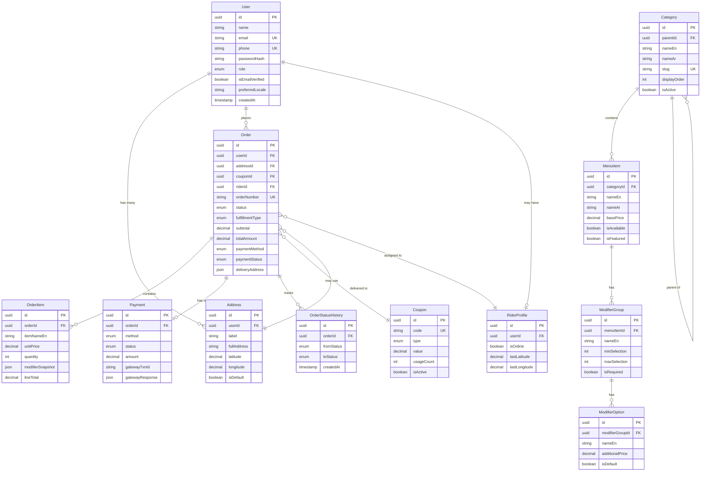

---

# 12. Frontend Architecture

## 12.1 Next.js App Router Structure

```
app/
├── layout.tsx                    # Root layout: font, i18n provider, theme
├── [locale]/                     # Locale segment: en | ar
│   ├── layout.tsx                # Sets dir="rtl"|"ltr", lang attribute
│   ├── page.tsx                  # Home: hero + menu preview
│   ├── menu/
│   │   ├── page.tsx              # Full menu (RSC — server fetch)
│   │   ├── [category]/
│   │   │   └── page.tsx          # Category-filtered menu
│   │   └── loading.tsx           # Skeleton loader
│   ├── cart/
│   │   └── page.tsx              # Client Component (cart state)
│   ├── checkout/
│   │   ├── layout.tsx
│   │   ├── page.tsx              # Checkout orchestrator
│   │   └── loading.tsx
│   ├── order/
│   │   └── [orderId]/
│   │       ├── page.tsx          # Order detail (RSC)
│   │       └── track/
│   │           └── page.tsx      # Live tracking (Client Component)
│   ├── auth/
│   │   ├── login/page.tsx
│   │   ├── register/page.tsx
│   │   ├── forgot-password/page.tsx
│   │   ├── reset-password/page.tsx
│   │   ├── verify-email/page.tsx
│   │   └── phone-otp/page.tsx
│   ├── profile/
│   │   ├── layout.tsx            # Profile sidebar nav
│   │   ├── page.tsx
│   │   ├── orders/page.tsx
│   │   └── addresses/page.tsx
│   ├── admin/
│   │   ├── layout.tsx            # Admin shell (requires ADMIN role)
│   │   ├── dashboard/page.tsx
│   │   ├── orders/page.tsx       # Client Component (real-time)
│   │   ├── menu/
│   │   │   ├── categories/page.tsx
│   │   │   └── items/page.tsx
│   │   ├── users/page.tsx
│   │   ├── coupons/page.tsx
│   │   ├── banners/page.tsx
│   │   └── reports/page.tsx
│   └── rider/
│       ├── layout.tsx            # Rider shell (requires RIDER role)
│       ├── dashboard/page.tsx
│       └── delivery/[orderId]/page.tsx
├── api/                          # Next.js Route Handlers (thin proxy to NestJS)
│   ├── auth/[...nextauth]/route.ts
│   └── health/route.ts
└── middleware.ts                 # i18n routing, auth checks
```

## 12.2 Rendering Strategy

| Route | Strategy | Rationale |
|-------|----------|-----------|
| `/menu` | ISR (revalidate: 300s) | Menu changes infrequently; cache for SEO and performance |
| `/menu/[category]` | ISR (revalidate: 300s) | Same as above |
| `/menu/item/[slug]` | ISR (revalidate: 300s) | Item detail for SEO |
| `/cart` | CSR (Client Component) | Dynamic cart state, no SEO value |
| `/checkout` | CSR | Dynamic, personalized |
| `/order/[id]/track` | CSR | Real-time WebSocket |
| `/admin/**` | CSR | Real-time, authenticated, no SEO |
| `/auth/**` | CSR | Forms, client-only |
| `/ (home)` | SSG + ISR | SEO-critical, banners change occasionally |

## 12.3 Component Architecture

```typescript
// Component hierarchy convention

// Server Component (default) — no interactivity
// app/[locale]/menu/page.tsx
export default async function MenuPage() {
  const menu = await fetchMenu(); // Server-side fetch with cache
  return <MenuGrid categories={menu.categories} />;
}

// Client Component — interactivity required
// components/cart/CartButton.tsx
'use client';
import { useCartStore } from '@/stores/cart.store';

export function CartButton({ item }: { item: MenuItem }) {
  const addItem = useCartStore((s) => s.addItem);
  return <button onClick={() => addItem(item)}>Add to Cart</button>;
}
```

## 12.4 State Management

| State Domain | Solution | Rationale |
|--------------|----------|-----------|
| Cart | Zustand + localStorage persistence | Simple, lightweight, no boilerplate |
| Auth session | NextAuth.js session + Zustand | NextAuth handles JWT; Zustand for reactive UI state |
| Order tracking | React Query (TanStack) + Socket.IO | Server state sync + real-time override |
| UI (modals, language) | Zustand | Global UI state |
| Forms | React Hook Form + Zod | Type-safe validation, minimal re-renders |
| Server state | TanStack Query v5 | Caching, background refetch, stale-while-revalidate |

## 12.5 Key Libraries

```json
{
  "dependencies": {
    "next": "14.x",
    "react": "18.x",
    "next-intl": "3.x",
    "next-auth": "5.x (beta)",
    "@tanstack/react-query": "5.x",
    "zustand": "4.x",
    "react-hook-form": "7.x",
    "zod": "3.x",
    "@hookform/resolvers": "3.x",
    "socket.io-client": "4.x",
    "@googlemaps/js-api-loader": "1.x",
    "tailwindcss": "3.x",
    "@shadcn/ui": "latest",
    "lucide-react": "0.x",
    "recharts": "2.x",
    "next-pwa": "5.x",
    "framer-motion": "11.x",
    "react-hot-toast": "2.x"
  },
  "devDependencies": {
    "typescript": "5.x",
    "@types/node": "20.x",
    "eslint": "8.x",
    "prettier": "3.x",
    "@playwright/test": "1.x",
    "vitest": "1.x"
  }
}
```

## 12.6 RTL Implementation

```typescript
// middleware.ts — language detection and routing
import { NextRequest, NextResponse } from 'next/server';
import { match } from '@formatjs/intl-localematcher';

const locales = ['en', 'ar'];
const defaultLocale = 'en';

export function middleware(request: NextRequest) {
  const { pathname } = request.nextUrl;
  const pathnameHasLocale = locales.some(
    (locale) => pathname.startsWith(`/${locale}/`) || pathname === `/${locale}`
  );
  if (pathnameHasLocale) return;

  const locale = getLocale(request) ?? defaultLocale;
  request.nextUrl.pathname = `/${locale}${pathname}`;
  return NextResponse.redirect(request.nextUrl);
}

// app/[locale]/layout.tsx — RTL toggle
export default function LocaleLayout({
  children,
  params: { locale },
}: {
  children: React.ReactNode;
  params: { locale: string };
}) {
  return (
    <html lang={locale} dir={locale === 'ar' ? 'rtl' : 'ltr'}>
      <body className={locale === 'ar' ? 'font-arabic' : 'font-latin'}>
        {children}
      </body>
    </html>
  );
}
```

Tailwind config for RTL:
```javascript
// tailwind.config.ts
module.exports = {
  content: ['./app/**/*.{ts,tsx}', './components/**/*.{ts,tsx}'],
  theme: {
    extend: {
      fontFamily: {
        arabic: ['Cairo', 'Noto Sans Arabic', 'sans-serif'],
        latin: ['Inter', 'sans-serif'],
      },
    },
  },
  plugins: [require('@tailwindcss/typography'), require('tailwindcss-rtl')],
};
```

---

# 13. Backend Architecture

## 13.1 NestJS Module Structure

```
src/
├── main.ts                    # Bootstrap: CORS, helmet, rate limiting, Swagger
├── app.module.ts              # Root module imports
├── modules/
│   ├── auth/                  # Authentication & Authorization
│   │   ├── auth.module.ts
│   │   ├── auth.controller.ts
│   │   ├── auth.service.ts
│   │   ├── strategies/
│   │   │   ├── jwt.strategy.ts
│   │   │   ├── google.strategy.ts
│   │   │   └── local.strategy.ts
│   │   ├── guards/
│   │   │   ├── jwt-auth.guard.ts
│   │   │   ├── roles.guard.ts
│   │   │   └── throttle.guard.ts
│   │   └── dto/
│   │       ├── login.dto.ts
│   │       ├── register.dto.ts
│   │       └── phone-otp.dto.ts
│   ├── users/                 # User profile management
│   ├── menu/                  # Categories, items, modifiers
│   ├── cart/                  # Cart operations (guest + authenticated)
│   ├── orders/                # Order lifecycle management
│   ├── payments/              # Paymob integration, Fawry
│   ├── riders/                # Rider management, GPS, assignments
│   ├── coupons/               # Coupon validation & management
│   ├── admin/                 # Admin-specific endpoints
│   ├── notifications/         # SMS, Email, Push orchestration
│   └── analytics/             # Reports, metrics
├── gateways/
│   └── events.gateway.ts      # Socket.IO gateway (order events, rider GPS)
├── common/
│   ├── decorators/            # @Roles(), @CurrentUser(), @ApiAuth()
│   ├── filters/               # GlobalExceptionFilter
│   ├── interceptors/          # LoggingInterceptor, TransformInterceptor
│   ├── pipes/                 # ValidationPipe, ParseUUIDPipe
│   ├── guards/                # Global auth guards
│   └── dto/                   # Shared DTOs (PaginationDto, ApiResponseDto)
├── config/
│   ├── database.config.ts
│   ├── redis.config.ts
│   ├── jwt.config.ts
│   └── app.config.ts
└── prisma/
    ├── prisma.service.ts
    └── schema.prisma
```

## 13.2 NestJS Bootstrap Configuration

```typescript
// src/main.ts
import { NestFactory } from '@nestjs/core';
import { ValidationPipe, VersioningType } from '@nestjs/common';
import { SwaggerModule, DocumentBuilder } from '@nestjs/swagger';
import helmet from 'helmet';
import compression from 'compression';
import { AppModule } from './app.module';
import { GlobalExceptionFilter } from './common/filters/global-exception.filter';
import { LoggingInterceptor } from './common/interceptors/logging.interceptor';

async function bootstrap() {
  const app = await NestFactory.create(AppModule, {
    logger: ['error', 'warn', 'log'],
  });

  // Security headers
  app.use(helmet({
    contentSecurityPolicy: {
      directives: {
        defaultSrc: ["'self'"],
        scriptSrc: ["'self'", "'unsafe-inline'", 'https://js.pusher.com'],
        connectSrc: ["'self'", 'wss://*.yourdomain.com'],
      },
    },
    crossOriginEmbedderPolicy: false,
  }));

  app.use(compression());

  // CORS — restrict to known origins
  app.enableCors({
    origin: [process.env.FRONTEND_URL!, process.env.ADMIN_URL!],
    credentials: true,
    methods: ['GET', 'POST', 'PATCH', 'DELETE'],
  });

  // Global validation — whitelist strips unknown fields
  app.useGlobalPipes(new ValidationPipe({
    whitelist: true,
    forbidNonWhitelisted: true,
    transform: true,
    transformOptions: { enableImplicitConversion: true },
  }));

  app.useGlobalFilters(new GlobalExceptionFilter());
  app.useGlobalInterceptors(new LoggingInterceptor());

  // API versioning
  app.enableVersioning({ type: VersioningType.URI });
  app.setGlobalPrefix('api');

  // Swagger (disable in production)
  if (process.env.NODE_ENV !== 'production') {
    const config = new DocumentBuilder()
      .setTitle('Food Ordering API')
      .setVersion('1.0')
      .addBearerAuth()
      .build();
    SwaggerModule.setup('docs', app, SwaggerModule.createDocument(app, config));
  }

  await app.listen(process.env.PORT ?? 3001);
}
bootstrap();
```

## 13.3 Authentication Module Detail

```typescript
// src/modules/auth/dto/register.dto.ts
import { IsEmail, IsString, MinLength, Matches, IsOptional } from 'class-validator';
import { ApiProperty } from '@nestjs/swagger';

export class RegisterDto {
  @ApiProperty({ example: 'Ahmed Hassan' })
  @IsString()
  @MinLength(2)
  name: string;

  @ApiProperty({ example: 'ahmed@example.com' })
  @IsEmail()
  email: string;

  @ApiProperty({ example: '+201001234567' })
  @IsString()
  @Matches(/^\+20[0-9]{10}$/, { message: 'Phone must be an Egyptian number (+20XXXXXXXXXX)' })
  phone: string;

  @ApiProperty()
  @IsString()
  @MinLength(8)
  @Matches(/^(?=.*[A-Z])(?=.*\d)(?=.*[@$!%*?&])[A-Za-z\d@$!%*?&]{8,}$/, {
    message: 'Password must contain uppercase, digit, and special character',
  })
  password: string;
}

// src/modules/auth/auth.service.ts (excerpt)
@Injectable()
export class AuthService {
  constructor(
    private readonly prisma: PrismaService,
    private readonly jwtService: JwtService,
    private readonly cacheManager: Cache,
    private readonly notificationService: NotificationService,
  ) {}

  async register(dto: RegisterDto): Promise<{ message: string }> {
    // Normalize email to lowercase
    const email = dto.email.toLowerCase().trim();

    // Check for existing account
    const existing = await this.prisma.user.findUnique({ where: { email } });
    if (existing) throw new ConflictException('Email already registered');

    // Hash password with bcrypt cost factor 12
    const passwordHash = await bcrypt.hash(dto.password, 12);

    const user = await this.prisma.user.create({
      data: {
        name: dto.name,
        email,
        phone: dto.phone,
        passwordHash,
        role: 'CUSTOMER',
        isEmailVerified: false,
      },
    });

    // Send verification email (async, non-blocking)
    this.notificationService.sendEmailVerification(user.id, user.email).catch((err) => {
      // Log but don't fail registration
      this.logger.error({ err, userId: user.id }, 'Failed to send verification email');
    });

    return { message: 'Registration successful. Please verify your email.' };
  }

  async generateTokens(userId: string, role: string) {
    const payload = { sub: userId, role };
    const [accessToken, refreshToken] = await Promise.all([
      this.jwtService.signAsync(payload, {
        secret: process.env.JWT_ACCESS_SECRET,
        expiresIn: '15m',
      }),
      this.jwtService.signAsync(payload, {
        secret: process.env.JWT_REFRESH_SECRET,
        expiresIn: '7d',
      }),
    ]);

    // Store refresh token hash in Redis (for revocation support)
    const tokenHash = crypto.createHash('sha256').update(refreshToken).digest('hex');
    await this.cacheManager.set(
      `refresh_token:${userId}`,
      tokenHash,
      7 * 24 * 60 * 60, // 7 days in seconds
    );

    return { accessToken, refreshToken };
  }
}
```

## 13.4 Orders Module — State Machine

```typescript
// src/modules/orders/order-status.machine.ts
export const ORDER_STATUS_TRANSITIONS: Record<OrderStatus, OrderStatus[]> = {
  PLACED: ['CONFIRMED', 'CANCELLED'],
  CONFIRMED: ['PREPARING', 'CANCELLED'],
  PREPARING: ['READY', 'CANCELLED'],
  READY: ['OUT_FOR_DELIVERY', 'DELIVERED', 'CANCELLED'],
  OUT_FOR_DELIVERY: ['DELIVERED', 'CANCELLED'],
  DELIVERED: [],    // Terminal state
  CANCELLED: [],    // Terminal state
};

export function isValidTransition(from: OrderStatus, to: OrderStatus): boolean {
  return ORDER_STATUS_TRANSITIONS[from]?.includes(to) ?? false;
}
```

## 13.5 Global Exception Filter

```typescript
// src/common/filters/global-exception.filter.ts
import {
  ExceptionFilter,
  Catch,
  ArgumentsHost,
  HttpException,
  HttpStatus,
  Logger,
} from '@nestjs/common';
import { Request, Response } from 'express';
import { Prisma } from '@prisma/client';

@Catch()
export class GlobalExceptionFilter implements ExceptionFilter {
  private readonly logger = new Logger(GlobalExceptionFilter.name);

  catch(exception: unknown, host: ArgumentsHost) {
    const ctx = host.switchToHttp();
    const response = ctx.getResponse<Response>();
    const request = ctx.getRequest<Request>();

    let status = HttpStatus.INTERNAL_SERVER_ERROR;
    let type = 'https://api.yourdomain.com/errors/internal-error';
    let title = 'Internal Server Error';
    let detail = 'An unexpected error occurred';

    if (exception instanceof HttpException) {
      status = exception.getStatus();
      const exceptionResponse = exception.getResponse();
      detail = typeof exceptionResponse === 'string'
        ? exceptionResponse
        : (exceptionResponse as any).message;
      title = exception.message;
      type = `https://api.yourdomain.com/errors/${status}`;
    } else if (exception instanceof Prisma.PrismaClientKnownRequestError) {
      if (exception.code === 'P2002') {
        status = HttpStatus.CONFLICT;
        title = 'Conflict';
        detail = 'A record with this value already exists';
        type = 'https://api.yourdomain.com/errors/conflict';
      }
    }

    // Log with structured fields for monitoring
    this.logger.error({
      requestId: request.headers['x-request-id'],
      method: request.method,
      url: request.url,
      status,
      error: exception instanceof Error ? exception.message : String(exception),
      stack: exception instanceof Error ? exception.stack : undefined,
    });

    // RFC 7807 Problem Details response
    response.status(status).json({
      type,
      title,
      status,
      detail,
      instance: `${request.method} ${request.url}`,
      timestamp: new Date().toISOString(),
    });
  }
}
```

---

# 14. Database Design

## 14.1 Schema Philosophy

- Use UUIDs for all primary keys (prevents enumeration attacks)
- `snake_case` for all column names
- `created_at` / `updated_at` on every table (Prisma `@updatedAt`)
- Soft deletes via `deleted_at` on user-facing entities (menu items, users)
- Denormalize order snapshot: store item names/prices at time of order — never reference live menu from historical orders
- Use `NUMERIC(10,2)` for all monetary values — never FLOAT
- Enum types for status fields (PostgreSQL native ENUMs via Prisma)

## 14.2 Prisma Schema

```prisma
// prisma/schema.prisma
generator client {
  provider        = "prisma-client-js"
  previewFeatures = ["fullTextSearch"]
}

datasource db {
  provider = "postgresql"
  url      = env("DATABASE_URL")
}

// ─── ENUMS ────────────────────────────────────────────────────

enum Role {
  CUSTOMER
  ADMIN
  RIDER
  SUPER_ADMIN
}

enum OrderStatus {
  PLACED
  CONFIRMED
  PREPARING
  READY
  OUT_FOR_DELIVERY
  DELIVERED
  CANCELLED
}

enum FulfillmentType {
  DELIVERY
  PICKUP
  DINE_IN
}

enum PaymentMethod {
  CARD
  FAWRY
  WALLET
  CASH_ON_DELIVERY
  CASH_AT_PICKUP
}

enum PaymentStatus {
  PENDING
  PAID
  FAILED
  REFUNDED
  REFUND_INITIATED
}

enum CouponType {
  PERCENTAGE
  FIXED_AMOUNT
  FREE_DELIVERY
}

enum AuthProvider {
  EMAIL
  GOOGLE
  PHONE
}

// ─── USERS ────────────────────────────────────────────────────

model User {
  id                String    @id @default(uuid())
  name              String
  email             String?   @unique
  phone             String?   @unique
  passwordHash      String?
  authProvider      AuthProvider @default(EMAIL)
  googleId          String?   @unique
  role              Role      @default(CUSTOMER)
  isEmailVerified   Boolean   @default(false)
  isPhoneVerified   Boolean   @default(false)
  isActive          Boolean   @default(true)
  preferredLocale   String    @default("en")
  deletedAt         DateTime?
  createdAt         DateTime  @default(now())
  updatedAt         DateTime  @updatedAt

  addresses         Address[]
  orders            Order[]
  refreshTokens     RefreshToken[]
  riderProfile      RiderProfile?

  @@map("users")
  @@index([email])
  @@index([phone])
  @@index([googleId])
}

model RefreshToken {
  id        String   @id @default(uuid())
  userId    String
  tokenHash String   @unique
  expiresAt DateTime
  createdAt DateTime @default(now())

  user      User     @relation(fields: [userId], references: [id], onDelete: Cascade)

  @@map("refresh_tokens")
  @@index([userId])
  @@index([tokenHash])
}

// ─── ADDRESSES ────────────────────────────────────────────────

model Address {
  id         String   @id @default(uuid())
  userId     String
  label      String   // "Home", "Work", custom
  fullAddress String
  landmark   String?
  latitude   Decimal  @db.Decimal(10, 7)
  longitude  Decimal  @db.Decimal(10, 7)
  isDefault  Boolean  @default(false)
  createdAt  DateTime @default(now())
  updatedAt  DateTime @updatedAt

  user       User     @relation(fields: [userId], references: [id], onDelete: Cascade)
  orders     Order[]

  @@map("addresses")
  @@index([userId])
}

// ─── MENU ─────────────────────────────────────────────────────

model Category {
  id            String      @id @default(uuid())
  nameEn        String
  nameAr        String
  slug          String      @unique
  description   String?
  imageUrl      String?
  displayOrder  Int         @default(0)
  isActive      Boolean     @default(true)
  parentId      String?
  createdAt     DateTime    @default(now())
  updatedAt     DateTime    @updatedAt

  parent        Category?   @relation("CategoryHierarchy", fields: [parentId], references: [id])
  children      Category[]  @relation("CategoryHierarchy")
  menuItems     MenuItem[]

  @@map("categories")
  @@index([slug])
  @@index([parentId])
  @@index([displayOrder])
}

model MenuItem {
  id              String          @id @default(uuid())
  categoryId      String
  nameEn          String
  nameAr          String
  slug            String          @unique
  descriptionEn   String?
  descriptionAr   String?
  basePrice       Decimal         @db.Decimal(10, 2)
  imageUrl        String?
  isAvailable     Boolean         @default(true)
  isFeatured      Boolean         @default(false)
  displayOrder    Int             @default(0)
  calories        Int?
  allergens       String[]
  deletedAt       DateTime?
  createdAt       DateTime        @default(now())
  updatedAt       DateTime        @updatedAt

  category        Category        @relation(fields: [categoryId], references: [id])
  modifierGroups  ModifierGroup[]

  @@map("menu_items")
  @@index([categoryId])
  @@index([slug])
  @@index([isAvailable])
  @@index([displayOrder])
}

model ModifierGroup {
  id           String     @id @default(uuid())
  menuItemId   String
  nameEn       String
  nameAr       String
  minSelection Int        @default(0)
  maxSelection Int        @default(1)
  isRequired   Boolean    @default(false)
  displayOrder Int        @default(0)

  menuItem     MenuItem   @relation(fields: [menuItemId], references: [id], onDelete: Cascade)
  options      ModifierOption[]

  @@map("modifier_groups")
  @@index([menuItemId])
}

model ModifierOption {
  id              String        @id @default(uuid())
  modifierGroupId String
  nameEn          String
  nameAr          String
  additionalPrice Decimal       @db.Decimal(10, 2) @default(0)
  isDefault       Boolean       @default(false)
  isAvailable     Boolean       @default(true)
  displayOrder    Int           @default(0)

  modifierGroup   ModifierGroup @relation(fields: [modifierGroupId], references: [id], onDelete: Cascade)

  @@map("modifier_options")
  @@index([modifierGroupId])
}

// ─── ORDERS ───────────────────────────────────────────────────

model Order {
  id                String          @id @default(uuid())
  orderNumber       String          @unique  // Human-readable: ORD-2024-001234
  userId            String?         // Null for guest orders
  guestName         String?
  guestPhone        String?
  guestEmail        String?
  addressId         String?
  deliveryAddress   Json?           // Snapshot of address at order time
  status            OrderStatus     @default(PLACED)
  fulfillmentType   FulfillmentType
  scheduledFor      DateTime?
  tableNumber       String?
  notes             String?
  subtotal          Decimal         @db.Decimal(10, 2)
  deliveryFee       Decimal         @db.Decimal(10, 2) @default(0)
  taxAmount         Decimal         @db.Decimal(10, 2)
  serviceFee        Decimal         @db.Decimal(10, 2) @default(0)
  discountAmount    Decimal         @db.Decimal(10, 2) @default(0)
  totalAmount       Decimal         @db.Decimal(10, 2)
  paymentMethod     PaymentMethod
  paymentStatus     PaymentStatus   @default(PENDING)
  couponId          String?
  riderId           String?
  cancelledAt       DateTime?
  cancelReason      String?
  deliveredAt       DateTime?
  createdAt         DateTime        @default(now())
  updatedAt         DateTime        @updatedAt

  user              User?           @relation(fields: [userId], references: [id])
  address           Address?        @relation(fields: [addressId], references: [id])
  coupon            Coupon?         @relation(fields: [couponId], references: [id])
  rider             RiderProfile?   @relation(fields: [riderId], references: [id])
  items             OrderItem[]
  payment           Payment?
  statusHistory     OrderStatusHistory[]

  @@map("orders")
  @@index([userId])
  @@index([status])
  @@index([riderId])
  @@index([createdAt])
  @@index([orderNumber])
  @@index([paymentStatus])
}

model OrderItem {
  id                String   @id @default(uuid())
  orderId           String
  menuItemId        String?  // Nullable in case item deleted later
  itemNameEn        String   // Snapshot
  itemNameAr        String   // Snapshot
  unitPrice         Decimal  @db.Decimal(10, 2)
  quantity          Int
  modifierSnapshot  Json     // Array of selected modifiers with prices
  itemNotes         String?
  lineTotal         Decimal  @db.Decimal(10, 2)

  order             Order    @relation(fields: [orderId], references: [id], onDelete: Cascade)

  @@map("order_items")
  @@index([orderId])
}

model OrderStatusHistory {
  id          String      @id @default(uuid())
  orderId     String
  fromStatus  OrderStatus?
  toStatus    OrderStatus
  changedById String?     // Admin or system user ID
  note        String?
  createdAt   DateTime    @default(now())

  order       Order       @relation(fields: [orderId], references: [id], onDelete: Cascade)

  @@map("order_status_history")
  @@index([orderId])
}

// ─── PAYMENTS ─────────────────────────────────────────────────

model Payment {
  id                String        @id @default(uuid())
  orderId           String        @unique
  method            PaymentMethod
  status            PaymentStatus @default(PENDING)
  amount            Decimal       @db.Decimal(10, 2)
  currency          String        @default("EGP")
  gatewayOrderId    String?       // Paymob order ID
  gatewayTxnId      String?       // Paymob transaction ID
  fawryReferenceNum String?
  gatewayResponse   Json?         // Full gateway callback stored for audit
  refundedAmount    Decimal?      @db.Decimal(10, 2)
  refundedAt        DateTime?
  createdAt         DateTime      @default(now())
  updatedAt         DateTime      @updatedAt

  order             Order         @relation(fields: [orderId], references: [id])

  @@map("payments")
  @@index([orderId])
  @@index([gatewayTxnId])
  @@index([fawryReferenceNum])
}

// ─── COUPONS ──────────────────────────────────────────────────

model Coupon {
  id              String     @id @default(uuid())
  code            String     @unique
  type            CouponType
  value           Decimal    @db.Decimal(10, 2)
  minOrderAmount  Decimal?   @db.Decimal(10, 2)
  maxUsages       Int?
  perUserLimit    Int        @default(1)
  usageCount      Int        @default(0)
  isActive        Boolean    @default(true)
  validFrom       DateTime
  validUntil      DateTime?
  createdAt       DateTime   @default(now())
  updatedAt       DateTime   @updatedAt

  orders          Order[]

  @@map("coupons")
  @@index([code])
  @@index([isActive])
}

// ─── BANNERS ──────────────────────────────────────────────────

model Banner {
  id           String   @id @default(uuid())
  titleEn      String?
  titleAr      String?
  imageUrl     String
  linkUrl      String?
  displayOrder Int      @default(0)
  isActive     Boolean  @default(true)
  createdAt    DateTime @default(now())
  updatedAt    DateTime @updatedAt

  @@map("banners")
  @@index([isActive, displayOrder])
}

// ─── RIDERS ───────────────────────────────────────────────────

model RiderProfile {
  id          String   @id @default(uuid())
  userId      String   @unique
  vehicleType String?
  plateNumber String?
  isOnline    Boolean  @default(false)
  lastLatitude  Decimal? @db.Decimal(10, 7)
  lastLongitude Decimal? @db.Decimal(10, 7)
  lastSeenAt  DateTime?
  createdAt   DateTime @default(now())
  updatedAt   DateTime @updatedAt

  user        User     @relation(fields: [userId], references: [id])
  orders      Order[]

  @@map("rider_profiles")
}

// ─── SETTINGS ─────────────────────────────────────────────────

model Setting {
  key       String @id
  value     String
  updatedAt DateTime @updatedAt

  @@map("settings")
}
```

---

# 15. ERD Description

## 15.1 Entity Relationship Diagram



## 15.2 Critical Indexing Strategy

```sql
-- High-read indexes (from postgres-pro skill patterns)

-- Orders: most frequent queries
CREATE INDEX CONCURRENTLY idx_orders_user_created 
  ON orders (user_id, created_at DESC);

CREATE INDEX CONCURRENTLY idx_orders_status_created 
  ON orders (status, created_at DESC)
  WHERE status NOT IN ('DELIVERED', 'CANCELLED');  -- Partial: active orders only

CREATE INDEX CONCURRENTLY idx_orders_rider_active 
  ON orders (rider_id, status)
  WHERE rider_id IS NOT NULL AND status = 'OUT_FOR_DELIVERY';

-- Menu: category listing
CREATE INDEX CONCURRENTLY idx_menu_items_category_order 
  ON menu_items (category_id, display_order, is_available);

-- Full-text search on menu items (Arabic + English)
CREATE INDEX CONCURRENTLY idx_menu_items_fts 
  ON menu_items USING GIN (
    to_tsvector('simple', name_en || ' ' || name_ar)
  );

-- Payments: reconciliation queries
CREATE INDEX CONCURRENTLY idx_payments_gateway_txn 
  ON payments (gateway_txn_id) 
  WHERE gateway_txn_id IS NOT NULL;

-- Coupons: validation (hot path)
CREATE UNIQUE INDEX idx_coupons_code_active 
  ON coupons (code) 
  WHERE is_active = true;
```
